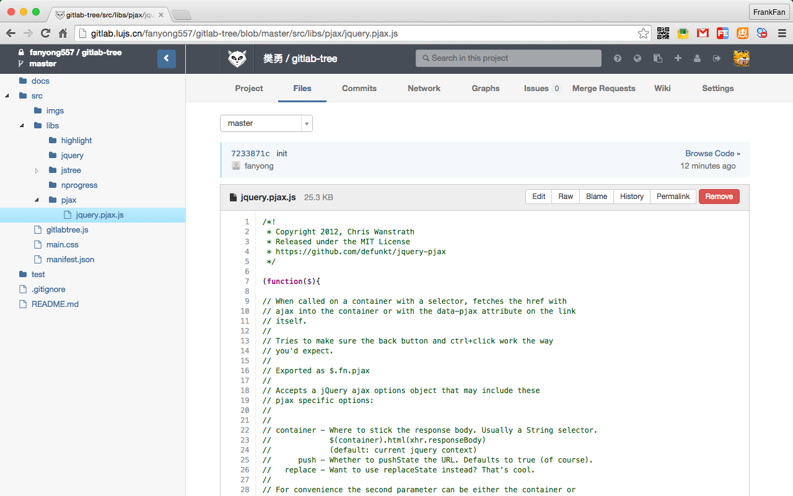

## gitlab-tree

Chrome extension to display Gitlab code in tree format. Useful for developers who frequently read source in Gitlab and do not want to download or checkout too many repositories.

Features:
* Easy-to-navigate code tree like web IDEs
* Fast browsing with pjax
* UI looks like Gitlab itself
* simple and non-invasive
* hotkey support(todo)

## install

Download and install Gitlab-Tree from [Chrome Web Store](https://chrome.google.com/webstore/detail/gitlab-tree/dllpphhnoanpcnlnipopibigdoeignbb?hl=zh-CN&gl=CN)

## screenshot

