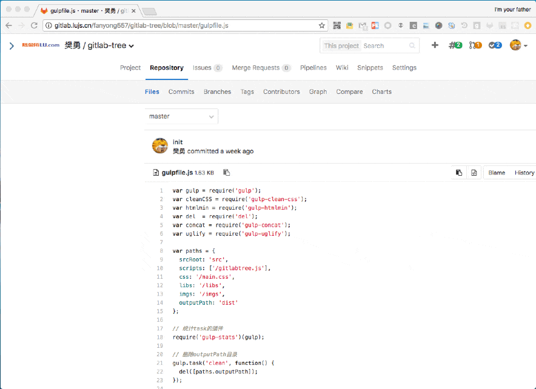

## gitlab-tree  

Chrome extension to display Gitlab code in tree format. Useful for developers who frequently read source in Gitlab and do not want to download or checkout too many repositories.

### features

* support all the enterprise intranet gitlab service
* Easy-to-navigate code tree like web IDEs, simple and non-invasive
* ~~Fast browsing with pjax~~
* UI looks like Gitlab default UI
* hotkey support( hit <kbd>[</kbd> to toggle gitlab-tree sidebar )
* support gitlab 9.x version( 8.x user use v1.5) :collision: :sparkles:

### install

Download and install Gitlab-Tree from [Chrome Web Store](https://chrome.google.com/webstore/detail/gitlab-tree/dllpphhnoanpcnlnipopibigdoeignbb)

### usage

1. install gitlab-tree
2. open a gitlab file url then you'll find a tree panel in the left of chrome window
3. if not, hit <kbd>F5</kbd> or <kbd>cmd</kbd> + <kbd>R</kbd> to refresh the page
4. still not work?  please feel free to let me know.

### screenshot

code with :heart: by FrankFan

